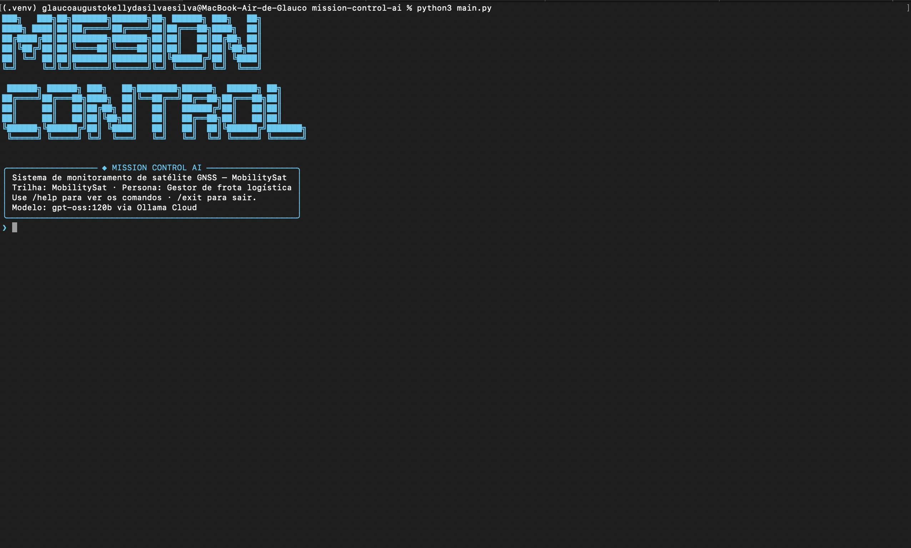
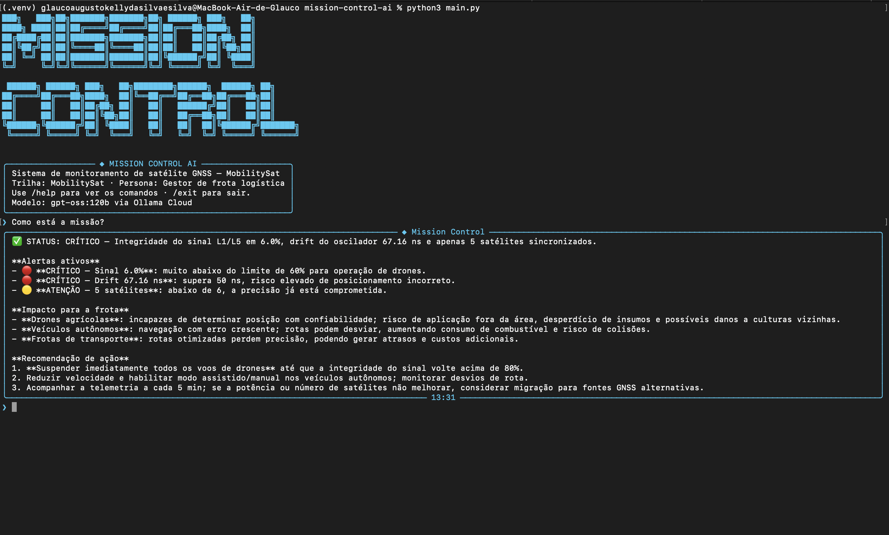
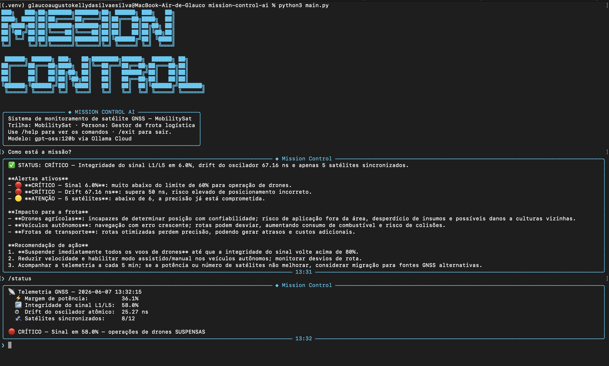
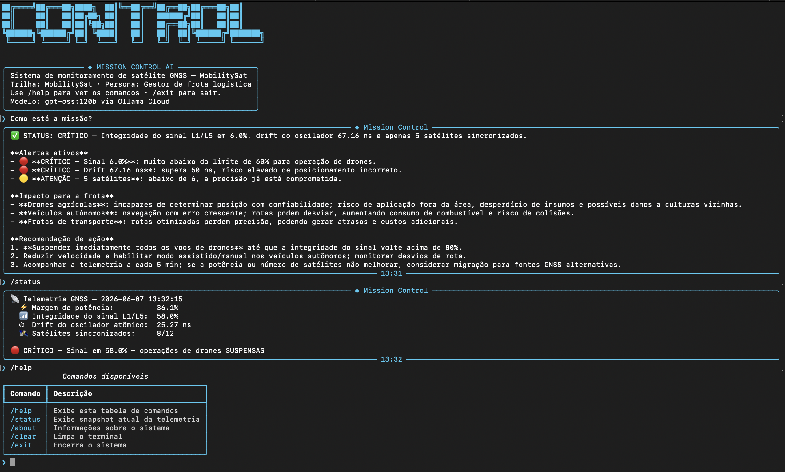

🚀 Mission Control AI — MobilitySat GNSS

**Modalidade:** Trio

## Integrantes

- Glauco Kelly — RM: 572840 — Turma: 1CCR
- Gabriel Fagundes — RM: 569074 — Turma: 1CCR
- Thiago Renatino — RM: 569073 — Turma: 1CCR

## O que o projeto faz

Mission Control AI é um sistema de monitoramento operacional de satélite GNSS que simula dados de telemetria em tempo real, detecta anomalias via lógica Python e usa IA generativa (Ollama Cloud, modelo gpt-oss:120b) para analisar o estado da missão em linguagem natural. O sistema traduz dados técnicos orbitais em alertas e recomendações claras para gestores de frota logística, operadores de drones agrícolas e engenheiros de segmento espacial.

## Personas atendidas

Conforme a trilha MobilitySat definida no enunciado, o sistema atende três personas:

| Persona | Papel no sistema |
|---|---|
| Gestor de frota logística | Persona principal — recebe alertas em linguagem de negócio sobre impacto nas operações de drones e veículos autônomos |
| Engenheiro de segmento espacial | Persona secundária — consome dados técnicos brutos da telemetria |
| Operador de agricultura de precisão | Persona secundária — recebe alertas sobre risco para drones e plantadeiras autônomas |

O tom das respostas da IA é calibrado para o gestor de frota logística.

## Tecnologias utilizadas

- Python 3.10+
- Ollama Cloud API (modelo gpt-oss:120b)
- Bibliotecas: ollama==0.6.2, python-dotenv==1.2.1, rich==15.0.0, prompt-toolkit==3.0.52, pyfiglet==1.0.4

## Como executar

1. Clone o repositório:
```bash
git clone https://github.com/FIAP-GS-01-2026/mission-control-ai.git
```

2. Crie o ambiente virtual:
```bash
python3 -m venv .venv && source .venv/bin/activate
```

3. Instale as dependências:
```bash
pip install -r requirements.txt
```

4. Crie o arquivo `.env` na raiz com:
OLLAMA_API_KEY=sua_chave_aqui

5. Execute o sistema:
```bash
python3 main.py
```

## Demonstração









## System Prompt

O system prompt completo está em [`prompts/system_prompt.md`](prompts/system_prompt.md).

Inclui contexto da missão MobilitySat, definição das três personas, thresholds dos 4 parâmetros monitorados, restrições de resposta e 3 exemplos de few-shot prompting.

## Cenários de teste demonstrados

1. **Operação normal** — todos os parâmetros dentro dos limites, IA autoriza operações normalmente
2. **Sinal crítico** — integridade do sinal L1/L5 abaixo de 60%, IA suspende operações de drones imediatamente
3. **Drift crítico** — oscilador atômico acima de 50ns, IA alerta risco de posicionamento incorreto
4. **Potência crítica** — margem abaixo de 20%, modo economia ativado automaticamente pelo sistema
5. **Constelação reduzida** — menos de 4 satélites sincronizados, IA alerta perda de posicionamento confiável
6. **Efeméride crítica** — erro de posição orbital acima de 5.0m, IA alerta comprometimento do posicionamento GNSS

## Limitações conhecidas

- A telemetria é simulada aleatoriamente via `random` — não consome dados reais de satélites
- O modelo gpt-oss:120b via Ollama Cloud requer conexão com internet para funcionar
- A versão `python-dotenv==1.2.2` especificada no enunciado não existe no PyPI — utilizamos `1.2.1`, versão mais próxima disponível, funcionalmente idêntica
- O sistema não persiste histórico entre sessões — a memória de contexto é reiniciada a cada execução do `main.py`

## 💼 Proposta de valor / modelo de negócio

**1. Problema real terrestre**

Veículos autônomos e drones agrícolas dependem de sinal GNSS de alta precisão para operar com segurança. Quando a qualidade do sinal degrada — por drift do oscilador, perda de sincronização ou queda de integridade — as operações são interrompidas ou se tornam perigosas, gerando prejuízo financeiro e risco operacional para empresas de agtech e gestores de frota.

**2. Quem paga pela solução**

Modelo híbrido: o governo financia a infraestrutura do satélite GNSS (como ocorre com o GPS americano e o Galileo europeu). O setor privado — empresas de agtech, fabricantes e operadoras de drones e veículos autônomos — paga pelo serviço de monitoramento e alerta de qualidade do sinal.

**3. Métrica de impacto**

Com o satélite operando 100% saudável por 1 ano: aproximadamente 2.000 drones agrícolas operam com segurança e precisão, reduzindo em cerca de 20% o desperdício de insumos causado por aplicações imprecisas decorrentes de sinal GNSS degradado.

**4. Modelo de negócio**

SaaS — assinatura mensal pelo sistema de monitoramento e alerta de qualidade do sinal GNSS, contratado por empresas de agtech e operadoras de veículos autônomos que dependem de posicionamento de alta precisão para suas operações diárias.

## 🎬 Vídeo de demonstração

🔗 [Assistir demonstração no YouTube]()

> Configurado como "Não listado" no YouTube.